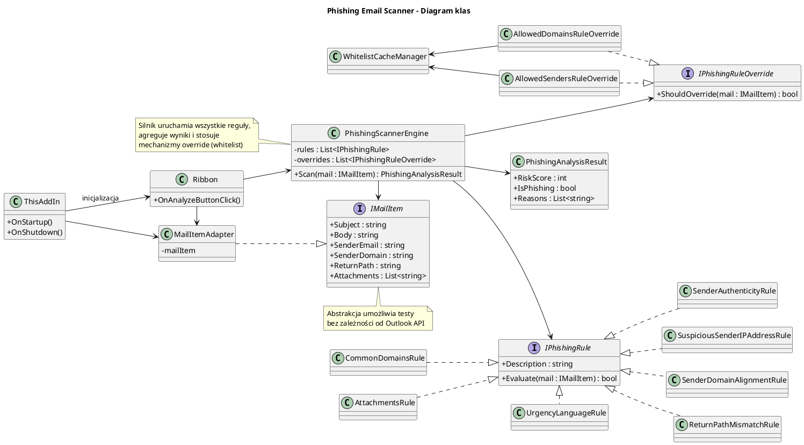

```plantuml
@startuml
title Phishing Email Scanner – Diagram klas
skinparam classAttributeIconSize 0
left to right direction

' =========================
' Outlook Add-in layer
' =========================
class ThisAddIn {
    +OnStartup()
    +OnShutdown()
}

class Ribbon {
    +OnAnalyzeButtonClick()
}

ThisAddIn --> Ribbon : inicjalizacja

' =========================
' Mail abstraction
' =========================
interface IMailItem {
    +Subject : string
    +Body : string
    +SenderEmail : string
    +SenderDomain : string
    +ReturnPath : string
    +Attachments : List<string>
}

class MailItemAdapter {
    -mailItem
}

MailItemAdapter .|> IMailItem

ThisAddIn -> MailItemAdapter
Ribbon -> MailItemAdapter

' =========================
' Core engine
' =========================
class PhishingScannerEngine {
    +Scan(mail : IMailItem) : PhishingAnalysisResult
    -rules : List<IPhishingRule>
    -overrides : List<IPhishingRuleOverride>
}

class PhishingAnalysisResult {
    +RiskScore : int
    +IsPhishing : bool
    +Reasons : List<string>
}

PhishingScannerEngine -right-> IMailItem
PhishingScannerEngine --> PhishingAnalysisResult

Ribbon --> PhishingScannerEngine

' =========================
' Rule interfaces
' =========================
interface IPhishingRule {
    +Evaluate(mail : IMailItem) : bool
    +Description : string
}

interface IPhishingRuleOverride {
    +ShouldOverride(mail : IMailItem) : bool
}

PhishingScannerEngine ---> IPhishingRuleOverride
PhishingScannerEngine --> IPhishingRule

' =========================
' Content analysis rules
' =========================
class UrgencyLanguageRule
class AttachmentsRule
class CommonDomainsRule

UrgencyLanguageRule .left.|> IPhishingRule
AttachmentsRule ..|> IPhishingRule
CommonDomainsRule ..|> IPhishingRule

' =========================
' Metadata analysis rules
' =========================
class SenderDomainAlignmentRule
class ReturnPathMismatchRule
class SenderAuthenticityRule
class SuspiciousSenderIPAddressRule

SenderDomainAlignmentRule .up.|> IPhishingRule
ReturnPathMismatchRule .up.|> IPhishingRule
SenderAuthenticityRule .up.|> IPhishingRule
SuspiciousSenderIPAddressRule .up.|> IPhishingRule

' =========================
' Rule overrides (whitelist)
' =========================
class AllowedSendersRuleOverride
class AllowedDomainsRuleOverride
class WhitelistCacheManager

AllowedSendersRuleOverride ..|> IPhishingRuleOverride
AllowedDomainsRuleOverride ..|> IPhishingRuleOverride

WhitelistCacheManager <-- AllowedSendersRuleOverride
WhitelistCacheManager <-- AllowedDomainsRuleOverride

' =========================
' Notes
' =========================
note left of PhishingScannerEngine
Silnik uruchamia wszystkie reguły,
agreguje wyniki i stosuje
mechanizmy override (whitelist)
end note

note bottom of IMailItem
Abstrakcja umożliwia testy
bez zależności od Outlook API
end note

@enduml
```
