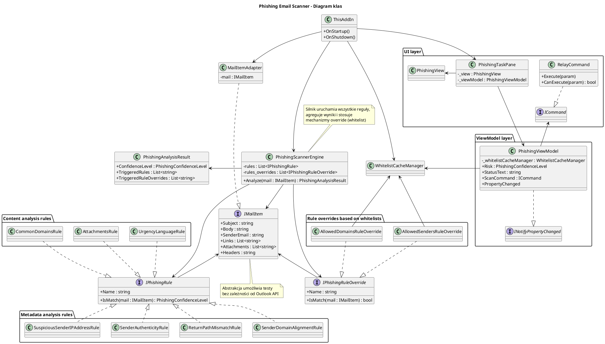

```plantuml
@startuml
title Phishing Email Scanner – Diagram klas
skinparam classAttributeIconSize 0

' =========================
' Outlook Add-in layer
' =========================
class ThisAddIn {
    +OnStartup()
    +OnShutdown()
}

' =========================
' Mail abstraction
' =========================
interface IMailItem {
    +Subject : string
    +Body : string
    +SenderEmail : string
    +Links : List<string>
    +Attachments : List<string>
    +Headers : string
}

' =========================
' UI layer
' =========================
package "UI layer" {

    class PhishingTaskPane {
        -_view : PhishingView
        -_viewModel : PhishingViewModel
    }

    class PhishingView {
    }

    class RelayCommand {
        +Execute(param)
        +CanExecute(param) : bool
    }

    interface ICommand
}

' =========================
' ViewModel layer (MVVM)
' =========================
package "ViewModel layer" {
    class PhishingViewModel {
        -_whitelistCacheManager : WhitelistCacheManager
        +Risk : PhishingConfidenceLevel
        +StatusText : string
        +ScanCommand : ICommand
        +PropertyChanged
    }

    interface INotifyPropertyChanged
}

RelayCommand ..|> ICommand
PhishingView <- PhishingTaskPane
PhishingTaskPane --> PhishingViewModel

PhishingViewModel ..|> INotifyPropertyChanged
PhishingViewModel -> WhitelistCacheManager
ICommand <-- PhishingViewModel

' =========================
' Add-in integration
' =========================
ThisAddIn --> PhishingTaskPane

class MailItemAdapter {
    -mail : IMailItem
}

MailItemAdapter ...|> IMailItem

ThisAddIn --> MailItemAdapter

' =========================
' Rule interfaces
' =========================
interface IPhishingRule {
    +IsMatch(mail : IMailItem) : PhishingConfidenceLevel
    +Name : string
}

interface IPhishingRuleOverride {
    +IsMatch(mail : IMailItem) : bool
    +Name : string
}

IMailItem <-- IPhishingRuleOverride
IMailItem <-- IPhishingRule

' =========================
' Core engine
' =========================
class PhishingScannerEngine {
    +Analyze(mail : IMailItem) : PhishingAnalysisResult
    -rules : List<IPhishingRule>
    -rules_overrides : List<IPhishingRuleOverride>
}

class PhishingAnalysisResult {
    +ConfidenceLevel : PhishingConfidenceLevel
    +TriggeredRules : List<string>
    +TriggeredRuleOverrides : List<string>
}

class WhitelistCacheManager

PhishingScannerEngine --> IMailItem
PhishingScannerEngine -left> PhishingAnalysisResult

ThisAddIn -> PhishingScannerEngine
ThisAddIn --> WhitelistCacheManager

PhishingScannerEngine --> IPhishingRuleOverride
PhishingScannerEngine --> IPhishingRule

' =========================
' Content analysis rules
' =========================
package "Content analysis rules" {
    class UrgencyLanguageRule
    class AttachmentsRule
    class CommonDomainsRule
}

UrgencyLanguageRule ..|> IPhishingRule
AttachmentsRule ..|> IPhishingRule
CommonDomainsRule ..|> IPhishingRule

' =========================
' Metadata analysis rules
' =========================
package "Metadata analysis rules" {
    class SenderDomainAlignmentRule
    class ReturnPathMismatchRule
    class SenderAuthenticityRule
    class SuspiciousSenderIPAddressRule
}

IPhishingRule <|.. SenderDomainAlignmentRule
IPhishingRule <|.. ReturnPathMismatchRule
IPhishingRule <|.. SenderAuthenticityRule
IPhishingRule <|.. SuspiciousSenderIPAddressRule

' =========================
' Rule overrides (whitelist)
' =========================

package "Rule overrides based on whitelists" {
    class AllowedSendersRuleOverride
    class AllowedDomainsRuleOverride
}

AllowedSendersRuleOverride ..|> IPhishingRuleOverride
AllowedDomainsRuleOverride ..|> IPhishingRuleOverride

WhitelistCacheManager <-- AllowedSendersRuleOverride
WhitelistCacheManager <-- AllowedDomainsRuleOverride

' =========================
' Notes
' =========================
note top of PhishingScannerEngine
Silnik uruchamia wszystkie reguły,
agreguje wyniki i stosuje
mechanizmy override (whitelist)
end note

note bottom of IMailItem
Abstrakcja umożliwia testy
bez zależności od Outlook API
end note

@enduml
```
