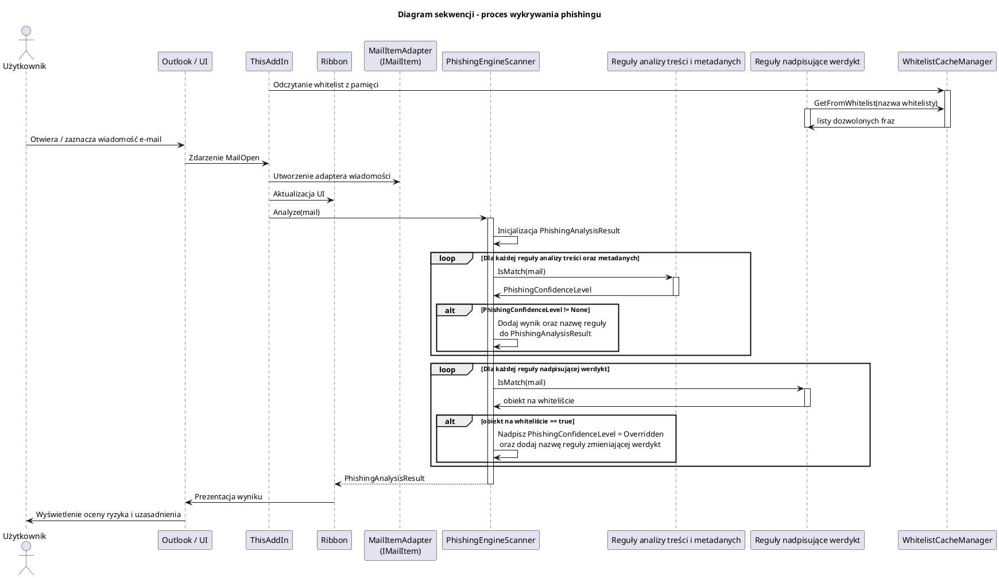

```plantuml
@startuml
title Diagram sekwencji – proces wykrywania phishingu

actor Użytkownik
participant "Outlook / UI" as Outlook
participant ThisAddIn
participant Ribbon
participant "MailItemAdapter\n(IMailItem)" as Mail
participant PhishingEngineScanner as Engine
participant "Reguły analizy treści i metadanych" as PhishingRules
participant "Reguły nadpisujące werdykt" as PhishingRulesOverride
participant "WhitelistCacheManager" as Whitelist

ThisAddIn -> Whitelist : Odczytanie whitelist z pamięci
activate Whitelist
PhishingRulesOverride -> Whitelist : GetFromWhitelist(nazwa whitelisty)
activate PhishingRulesOverride
Whitelist -> PhishingRulesOverride : listy dozwolonych fraz
deactivate PhishingRulesOverride
deactivate Whitelist

Użytkownik -> Outlook : Otwiera / zaznacza wiadomość e-mail
Outlook -> ThisAddIn : Zdarzenie MailOpen
ThisAddIn -> Mail : Utworzenie adaptera wiadomości
ThisAddIn -> Ribbon : Aktualizacja UI

ThisAddIn -> Engine : Analyze(mail)

activate Engine
Engine -> Engine : Inicjalizacja PhishingAnalysisResult

loop Dla każdej reguły analizy treści oraz metadanych
    Engine -> PhishingRules : IsMatch(mail)
    activate PhishingRules
    PhishingRules -> Engine : PhishingConfidenceLevel
    deactivate PhishingRules
    alt PhishingConfidenceLevel != None
        Engine -> Engine : Dodaj wynik oraz nazwę reguły\n do PhishingAnalysisResult
    end
end

loop Dla każdej reguły nadpisującej werdykt
    Engine -> PhishingRulesOverride : IsMatch(mail)
    activate PhishingRulesOverride
    PhishingRulesOverride -> Engine : obiekt na whiteliście
    deactivate PhishingRulesOverride
    alt obiekt na whiteliście == true
        Engine -> Engine : Nadpisz PhishingConfidenceLevel = Overridden\n oraz dodaj nazwę reguły zmieniającej werdykt
    end
end

Engine --> Ribbon : PhishingAnalysisResult
deactivate Engine

Ribbon -> Outlook : Prezentacja wyniku
Outlook -> Użytkownik : Wyświetlenie oceny ryzyka i uzasadnienia

@enduml
```
